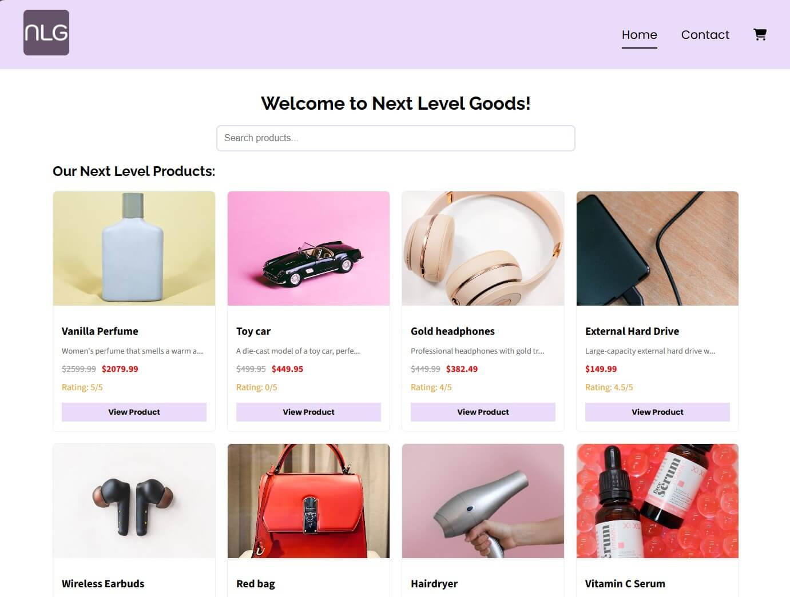

# Next Level Goods eComm store



## Description

This is my submission for the React Course Assignment for my Front-end Development studies at Noroff.  This website is an online store called Next Level Goods, and is an online store created with React and TypeScript that allows users to register and log in, browse and search for items, add items to the cart and proceed to checkout. The home page displays product cards in a grid, so that the user can view important aspects of the products; image, name, short description, price, price on sale, rating and a link to the specific product page. It includes a responsive navigation bar which features a hamburger menu for mobile screens and a shopping cart icon that dynamically updates the cart item count based on localStorage data.

## Features

- Responsive navigation bar with a hamburger menu for mobile devices.
- Responsive grid list at the home page that displays all products, each with a button linking to its specific product page.
- Cart item count is displayed and updated based on data from localStorage when products are added.
- Listens for a custom event (cartUpdated) to dynamically update the cart count.
- Cart page displays added products along with the total price calculated in real time.
- Styling is handled using styled-components.

## Goal

Create a functional, user-friendly front-end online store that integrates with the Noroff API to view products and manage the cart.

## Technologies Used

- HTML
- React
- TypeScript
- Styled-components

## Getting Started

### Installation

1. **Clone the repo:**

```bash
git clone https://github.com/TheRegzi/react-course-assignment.git
```

2. **Navigate to the project directory:**

```bash
cd react-course-assignment
```

3. **Install dependencies:**

```bash
npm install
```

4. **Start the development server:**

```bash
npm run dev
```

## Contributing

If you want to contribute, please make a pull request so any changes can be reviewed before being merged. If you have questions or ideas, feel free to open an issue. All contributions are welcome!

## Deployment

The project is hosted on Netlify. Visit the application at: https://nextlevelgoods.netlify.app

## Contact

[My LinkedIn Page](https://www.linkedin.com/in/regine-dille-kornbakk-aa0a7b288/)
